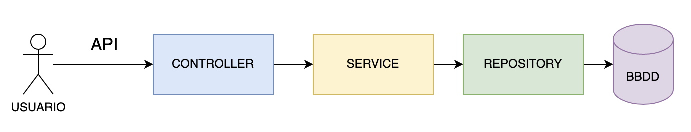
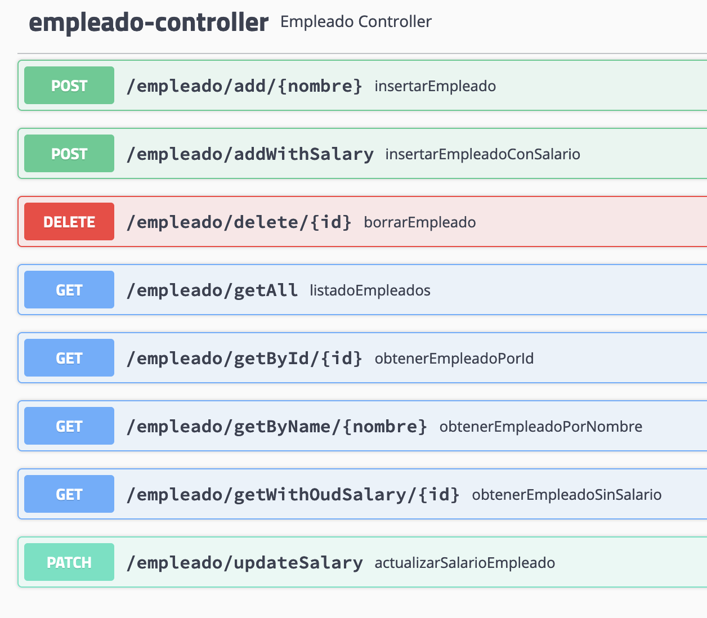

# Práctica de Microservicios

Vamos a generar una aplicación que hará de API Rest al estilo de un microservicio. 

## Stack tecnológico

- [Springboot](https://spring.io/), como framework de Java.
- [MySQL](https://www.mysql.com/), como motor de base de datos.
- [Docker](https://www.docker.com/), como solución de virtualización.
- [Maven](https://maven.apache.org/), como software de construcción de proyecto.
- [Swagger](https://swagger.io/), para documentar la API.
- [Postman](https://www.postman.com/), como plataforma para consumir una API.

## URL's de interés

- [http://localhost:8095/](http://localhost:8095/), URL de entrada a la aplicación.
- [http://localhost:8095/swagger-ui.html](http://localhost:8095/swagger-ui.html), URL de la documentación.


## MySQL en Docker

```
    $ docker run -d -p 33060:3306 --name mysql-db  -e MYSQL_ROOT_PASSWORD=temporal --mount src=mysql-db-data,dst=/var/lib/mysql mysql
```

```
    $ docker exec -it mysql-db mysql -p
```

```
    create database microservicios;
```
 
En el _application.properties_, establecer:

```properties
...
spring.datasource.url=jdbc:mysql://dockerhost:33060/microservicios
spring.datasource.driver-class-name=com.mysql.jdbc.Driver
spring.datasource.username=root
spring.datasource.password=temporal
...
```

En la primera ejecución será necesario crear la tabla, para ello descomentar, en el fichero _application.properties_:

```properties
...
# spring.jpa.hibernate.ddl-auto=create
...
```


## Estructura del proyecto

```
├───src/
│   ├───main/
│       ├───java/
│           │───es.iesfleming.ejemplo
│               │───config                          # Configuraciones de la aplicación
│                   │───SwaggerConfig                   # Clase para la documentación de la API.
│               │───controller                      # Controladores de la aplicación
│                   │───WebApplicationController        # Clase de entrada a la API.
│                   │───EmpleadoController              # Clase de entrada a la API de empleados.
│               │───entity                          # Entidades de la aplicación
│                   │───Empleado                        # Clase de la entidad de BBDD Empleado.
│               │───repository                      # Repositorios de la aplicación
│                   │───EmpleadoRepo                    # Clase para interactuar con la BBDD.
│               │───service                         # Servicios de la aplicación
│                   │───impl                        # Implementaciópn de servicios de la aplicación
│                       │───EmpleadoService             # Clase con la lógica de acceso al repositorio.
│                   │───EmpleadoService             # Interfaz de Empleado
```

## Capas



## Objetivo



## Pasos 

Rellenar la clase EmpleadoController


### Añadir un nuevo empleado

Añadimos el servicio:

````java
@Autowired
private EmpleadoService empService;
````
Añadimos el método para añadir un empleado:

````java
@RequestMapping(value="/add/{nombre}", method = RequestMethod.POST)
@ApiResponses(value = {
        @ApiResponse(code = 201, message = "Se han devuelto el empleado"),
        @ApiResponse(code = 409, message = "Ya existe un empleado con ese nombre")
})
public ResponseEntity<Empleado> insertarEmpleado(@PathVariable String nombre) {
        Empleado empleado = empService.obtenerEmpleadoPorNombre(nombre);
        if (empleado == null) {
            empleado = empService.insertarEmpleado(nombre, 0);
            return ResponseEntity.ok(empleado);
        }
        else{
            return new ResponseEntity<>(null, HttpStatus.CONFLICT);
        }
}
````

### Añadimos un método para listar todos los empleados

```java
@RequestMapping(value="/getAll", method = RequestMethod.GET)
@ApiResponses(value = {
        @ApiResponse(code = 200, message = "Se han devuelto todos los empleados")
})
public List<Empleado> listadoEmpleados(){
        return empService.listadoEmpleados();
}
```

### Borramos un empleado

````java
@RequestMapping(value="/delete/{id}", method = RequestMethod.DELETE)
@ApiResponses(value = {
        @ApiResponse(code = 202, message = "Se han borrado el empleado"),
        @ApiResponse(code = 404, message = "No existe un empleado con ese id")
})
public ResponseEntity borrarEmpleado(@PathVariable int id) {
        Empleado empleado = empService.obtenerEmpleadoPorId(id);
        if (empleado == null)
            return new ResponseEntity<>(null, HttpStatus.NOT_FOUND);
        else {
            empService.borrarEmpleado(id);
            return new ResponseEntity<>(null, HttpStatus.ACCEPTED);
        }
}
````

### Actualizamos el salario de un empleado

Creamos DTO:

````java
@Data
@Builder(toBuilder = true)
public class ActualizarSalarioEmpleadoPeticionDto implements Serializable {

    private static final long serialVersionUID = 1L;
    
    private int  id;
    
    private int salario;

}
````
Añadimos el método:

````java
@RequestMapping(value="/updateSalary", method = RequestMethod.PATCH)
@ApiResponses(value = {
        @ApiResponse(code = 202, message = "Se ha actualizado el empleado"),
        @ApiResponse(code = 404, message = "No existe un empleado con ese id")
})
public ResponseEntity actualizarSalarioEmpleado(@RequestBody ActualizarSalarioEmpleadoPeticionDto actualizarSalarioEmpleadoPeticionDto){
        Empleado empleado = empService.obtenerEmpleadoPorId(actualizarSalarioEmpleadoPeticionDto.getId());
        if (empleado == null)
            return new ResponseEntity<>(null, HttpStatus.NOT_FOUND);
        else {
            empService.actualizarSalarioEmpleado(actualizarSalarioEmpleadoPeticionDto.getId(),actualizarSalarioEmpleadoPeticionDto.getSalario());
            return new ResponseEntity<>(null, HttpStatus.ACCEPTED);
        }
}
````

### Añadimos el salario en la creación de un empleado

Creamos DTO:

````java
@Data
@Builder(toBuilder = true)
public class NuevoEmpleadoConSalarioPeticionDto implements Serializable {

    private static final long serialVersionUID = 1L;

    private String nombre;

    private int salario;

}
````

Creamos el método:

````java
@RequestMapping(value="/addWithSalary", method = RequestMethod.POST)
@ApiResponses(value = {
        @ApiResponse(code = 202, message = "Se ha insertado el empleado con el salario enviado"),
        @ApiResponse(code = 409, message = "Ya existe un empleado con ese nombre")
})
public ResponseEntity<Empleado> insertarEmpleadoConSalario(@RequestBody NuevoEmpleadoConSalarioPeticionDto nuevoEmpleadoConSalarioDto) {
        Empleado empleado = empService.obtenerEmpleadoPorNombre(nuevoEmpleadoConSalarioDto.getNombre());
        if (empleado == null) {
            empleado = empService.insertarEmpleado(nuevoEmpleadoConSalarioDto.getNombre(), nuevoEmpleadoConSalarioDto.getSalario());
            return ResponseEntity.ok(empleado);
        }
        else {
            return new ResponseEntity<>(null, HttpStatus.CONFLICT);
        }
}
````

### Listar empleados por nombre y por id

````java
    @RequestMapping(value="/getById/{id}", method = RequestMethod.GET)
    @ApiResponses(value = {
            @ApiResponse(code = 404, message = "No existe un empleado con ese id")
    })
    public ResponseEntity<Empleado> obtenerEmpleadoPorId(@PathVariable int id) {
        Empleado empleado = empService.obtenerEmpleadoPorId(id);
        if (empleado == null){
            return new ResponseEntity<>(null, HttpStatus.NOT_FOUND);
        } else {
            return ResponseEntity.ok(empleado);
        }
    }

    @RequestMapping(value="/getByName/{nombre}", method = RequestMethod.GET)
    @ApiResponses(value = {
            @ApiResponse(code = 404, message = "No existe un empleado con ese nombre")
    })
    public ResponseEntity<Empleado> obtenerEmpleadoPorNombre(@PathVariable String nombre) {
        Empleado empleado = empService.obtenerEmpleadoPorNombre(nombre);
        if (empleado == null){
            return new ResponseEntity<>(null, HttpStatus.NOT_FOUND);
        } else {
            return ResponseEntity.ok(empleado);
        }
    }
````

### Listar empleados pero sin mostrar el salario

Creamos el DTO:

````java
@Data
@Builder(toBuilder = true)
public class EmpleadoSinSalarioRespuestaDto implements Serializable {

    private static final long serialVersionUID = 1L;

    private String nombre;

}
````

Creamos el converter:

````java
@Component
@RequiredArgsConstructor
public class EmpleadoConverter {

    public EmpleadoSinSalarioRespuestaDto convertToEmpleadoResponseDto(Empleado empleado){
        return EmpleadoSinSalarioRespuestaDto.builder().nombre(empleado.getNombre()).build();
    }
}
````
Lo importamos:

```java
    @Autowired
    private EmpleadoConverter empleadoConverter;
```

Creamos el método:

````java
    @RequestMapping(value="/getWithOutSalary/{id}", method = RequestMethod.GET)
    @ApiResponses(value = {
            @ApiResponse(code = 404, message = "No existe un empleado con ese id")
    })
    public ResponseEntity<EmpleadoSinSalarioRespuestaDto> obtenerEmpleadoSinSalario(@PathVariable int id) {
        Empleado empleado = empService.obtenerEmpleadoPorId(id);
        if (empleado == null) {
            return new ResponseEntity<>(null, HttpStatus.NOT_FOUND);
        }
        else {
            EmpleadoSinSalarioRespuestaDto empleadoSinSalarioDto = empleadoConverter.convertToEmpleadoResponseDto(empleado);
            return ResponseEntity.ok(empleadoSinSalarioDto);
        }
    }
````
